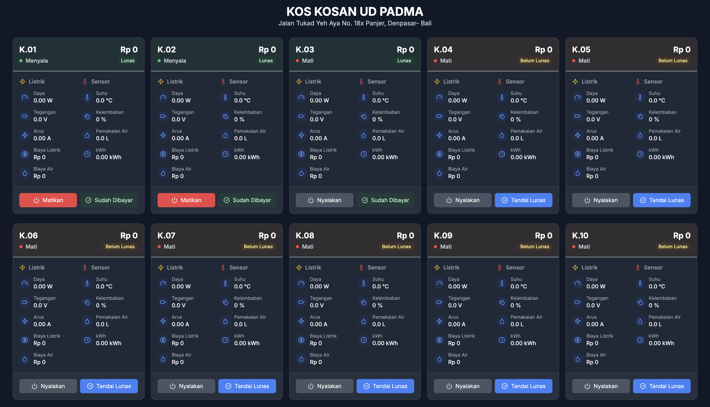

# Sistem Kos-Kosan Pintar UD Padma

Dashboard profesional untuk monitoring dan manajemen kos-kosan berbasis IoT. Menyediakan tampilan real-time penggunaan listrik, air, dan status kamar dengan antarmuka yang responsif dan mudah digunakan.



## Fitur Utama

- 📊 Monitoring real-time penggunaan listrik dan air
- 💰 Perhitungan biaya otomatis
- 🔌 Kontrol daya per kamar
- 💧 Pemantauan penggunaan air
- 🌓 Mode gelap/terang
- 📱 Tampilan responsif
- 📊 Grafik penggunaan harian/bulanan
- 🔔 Notifikasi status pembayaran

## Persyaratan Sistem

- Node.js (v16 atau lebih baru)
- npm atau yarn
- MQTT broker (contoh: Mosquitto, EMQX, dll.)
- Akses ke perangkat IoT (modul listrik dan air)

## Installation

1. Clone repository:
   ```bash
   git clone https://github.com/duwiarsana/Dashboard-Mqtt-Modul-Belajar.git
   cd Dashboard-Mqtt-Modul-Belajar
   ```

2. Install dependensi:
   ```bash
   npm install
   # atau
   yarn install
   ```

## Konfigurasi

1. Update konfigurasi MQTT di `src/config/mqtt.ts`:
   ```typescript
   export const mqttConfig = {
     brokerUrl: 'ws://your-mqtt-broker:8084',
     options: {
       clientId: 'modul-belajar-dashboard',
       clean: true,
       protocol: 'ws' as const,
       wsOptions: {
         rejectUnauthorized: false
       }
     },
     // Update topik sesuai kebutuhan
   };

## Deployment dengan Nginx

Contoh konfigurasi Nginx untuk reverse proxy (port 80):

```nginx
server {
    listen 80;
    server_name your-domain.com;

    location / {
        proxy_pass http://localhost:3000;
        proxy_http_version 1.1;
        proxy_set_header Upgrade $http_upgrade;
        proxy_set_header Connection 'upgrade';
        proxy_set_header Host $host;
        proxy_set_header X-Real-IP $remote_addr;
        proxy_set_header X-Forwarded-For $proxy_add_x_forwarded_for;
        proxy_set_header X-Forwarded-Proto $scheme;
        proxy_redirect off;
    }
}
```

**Catatan:**

- Pastikan port yang digunakan tidak diblok oleh firewall
- Gunakan HTTPS untuk koneksi yang lebih aman
- Sesuaikan `server_name` dengan domain atau IP server Anda

## Menyesuaikan Tampilan

Anda dapat menyesuaikan tampilan dengan memodifikasi komponen di direktori `src/components`

## Menjalankan Aplikasi

```bash
# Mode pengembangan
npm run dev
# atau
yarn dev

# Build untuk produksi
npm run build
# atau
yarn build

# Preview hasil build
npm run preview
# atau
yarn preview
```

## Variabel Lingkungan

Buat file `.env` di direktori root untuk mengatur variabel lingkungan:

```env
VITE_MQTT_URL=ws://your-mqtt-broker:8084
VITE_MQTT_USERNAME=your-username
VITE_MQTT_PASSWORD=your-password
VITE_APP_TITLE="Sistem Kos-Kosan Pintar UD Padma"
```

## Struktur Proyek

```
src/
├── components/         # Komponen UI yang dapat digunakan ulang
│   ├── KosanBlock.tsx   # Komponen blok kosan
│   └── RoomCard.tsx     # Kartu untuk setiap kamar
├── config/             # File konfigurasi
│   └── mqtt.ts        # Konfigurasi MQTT
├── App.tsx            # Komponen utama aplikasi
├── main.tsx           # Entry point aplikasi
└── index.css          # Gaya global
```

## Teknologi yang Digunakan

### Frontend

- **React 18** — Library UI untuk membangun antarmuka pengguna yang interaktif
- **TypeScript** — Memastikan kode lebih aman dan mudah dikelola
- **Tailwind CSS** — Framework CSS utility-first untuk desain responsif
- **Vite** — Build tool yang cepat dan ringan
- **MQTT.js** — Library untuk koneksi MQTT dari browser

### UI/UX

- **Hero Icons & Lucide** — Koleksi ikon SVG modern
- **Framer Motion** — Untuk animasi yang halus
- **Headless UI** — Komponen UI yang dapat diakses
- **Recharts** — Library grafik interaktif

### Fitur Khusus

- **Dark Mode** — Tema gelap/terang yang otomatis
- **Responsif** — Tampilan optimal di semua perangkat
- **Real-time Updates** — Pembaruan data secara langsung
- **User-friendly** — Antarmuka yang intuitif dan mudah digunakan

## Lisensi

Dibawah lisensi MIT

## Kontribusi

Kontribusi terbuka untuk pengembangan lebih lanjut. Silakan buat issue atau pull request.

## Dikembangkan Oleh

- **Anak Agung Duwi Arsana**
- [GitHub](https://github.com/duwiarsana)
- [YouTube](https://www.youtube.com/@anakagungduwiarsana)
- [Instagram](https://instagram.com/duwiarsana)
- WhatsApp: [0857-3824-4251](https://wa.me/6285738244251)

## 💰 Dukung Proyek Ini

Jika Anda merasa proyek ini bermanfaat, Anda bisa mendukung pengembangan lebih lanjut dengan berdonasi melalui:

[](https://saweria.co/duwiarsana)

Dukungan Anda sangat berarti untuk pengembangan fitur-fitur baru dan perbaikan proyek ini.

## Dukungan

Untuk dukungan teknis atau pertanyaan, silakan buat issue baru di repository ini.
